# Derma SaaS Platform

A production-ready dermatology clinic SaaS platform designed to manage appointments, services, products, and patient engagement through a unified digital experience.

Built for real-world clinic operations with scalability, security, and backend flexibility in mind.

---

## Overview

Derma SaaS enables dermatology clinics and aesthetic centers to streamline operations, improve patient experience, and gain actionable insights.

The platform connects clinic administrators and patients through a seamless booking, service management, and communication system.

---

## Screenshots

### 🧑‍⚕️ Admin Dashboard
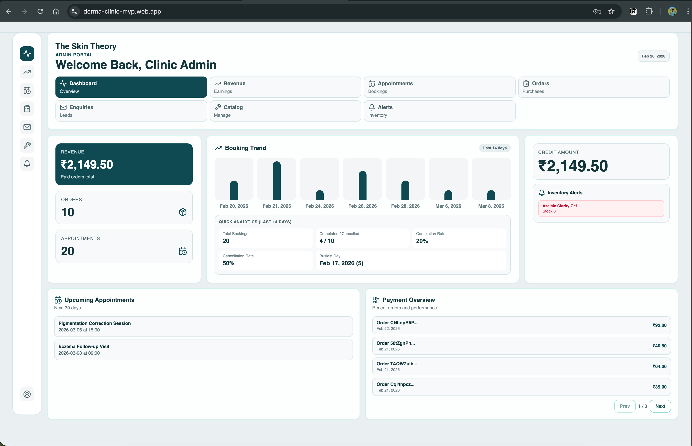

### 🗓 Appointment & Slot Management
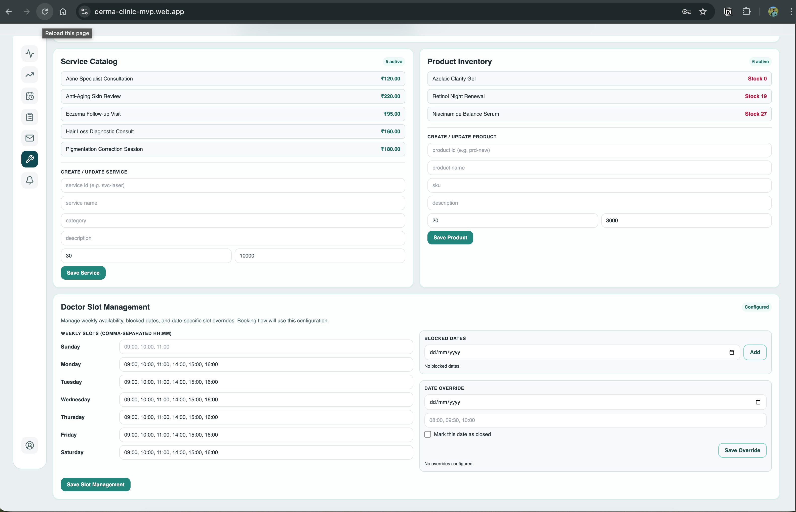

### 🧾 Service Catalog Management
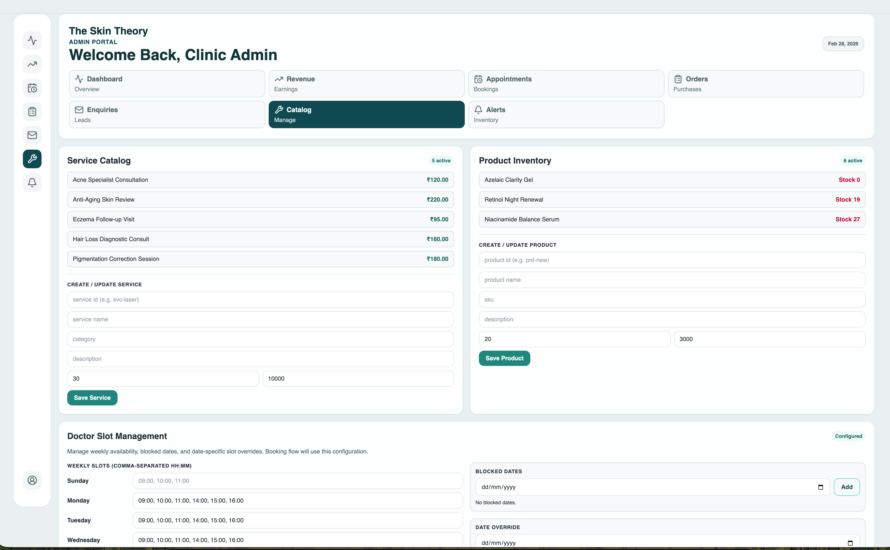

### 📦 Orders & Product Management
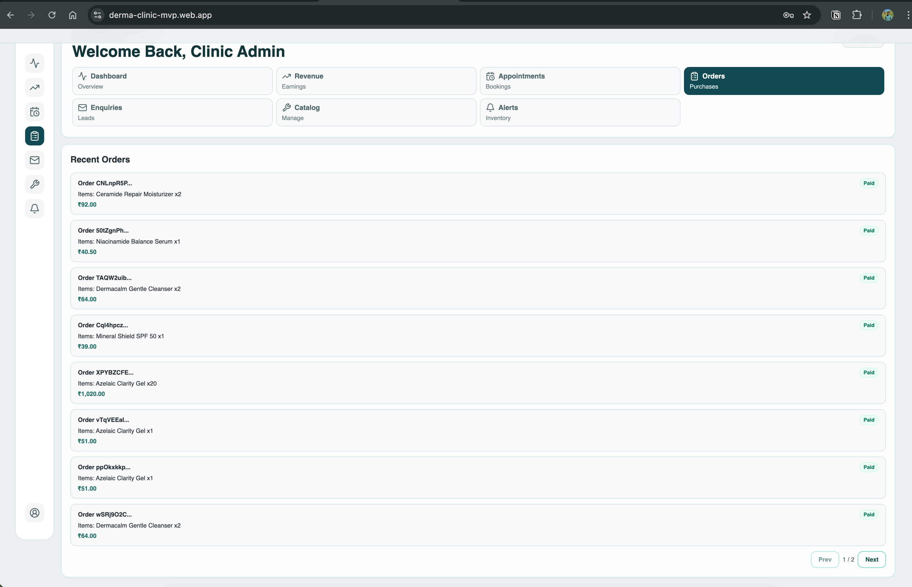

### 📊 Analytics & Insights
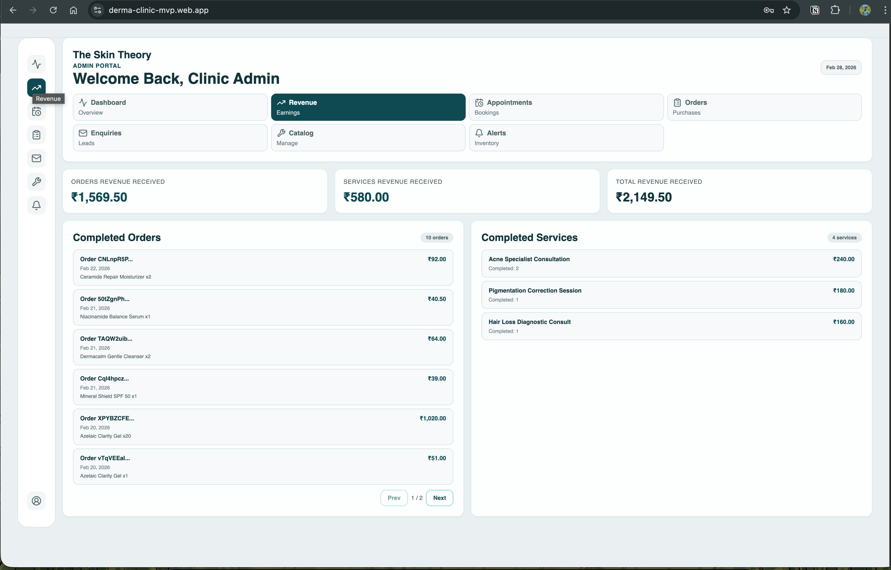

---

### 👤 Customer Service Catalog

<p align="center">
  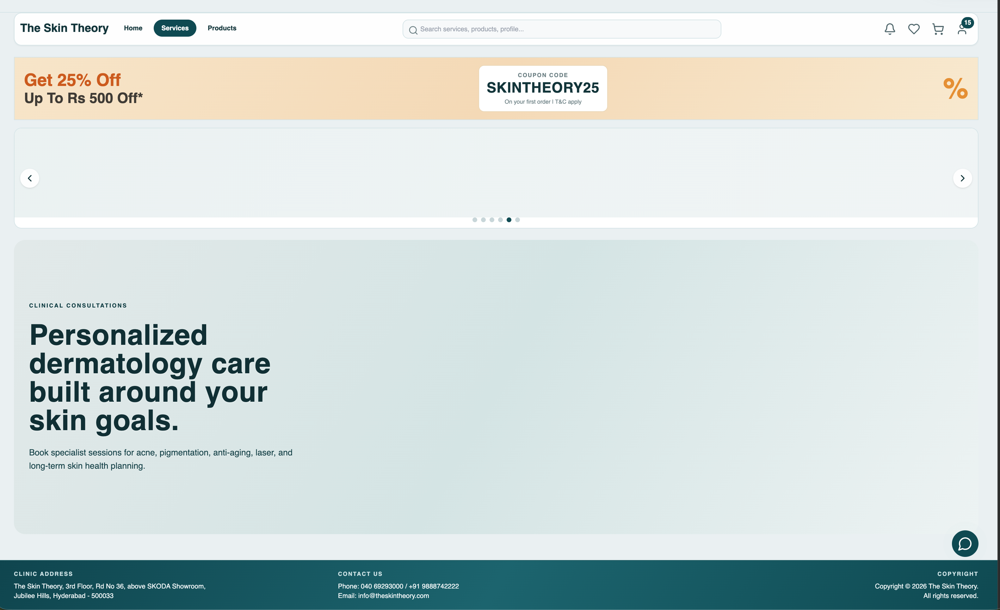
  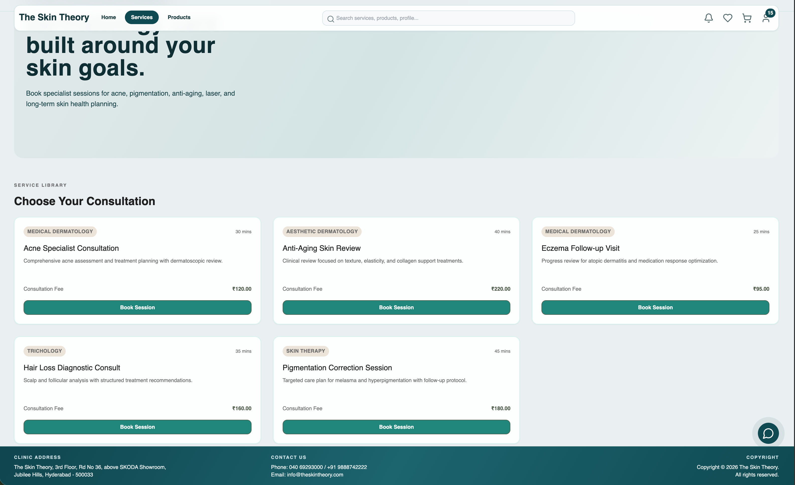
</p>

### 📅 Booking Flow

<p align="center">
  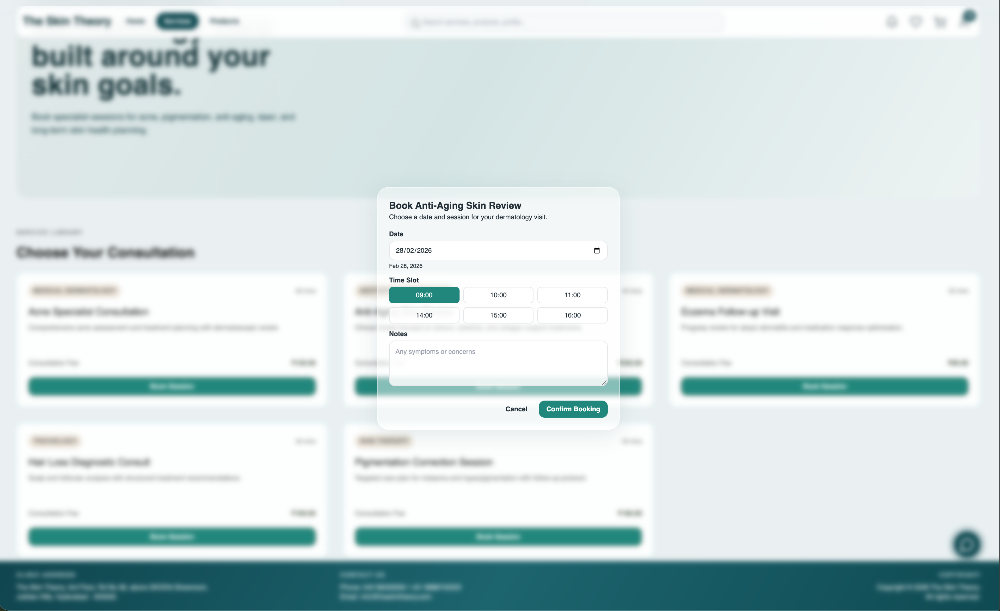
  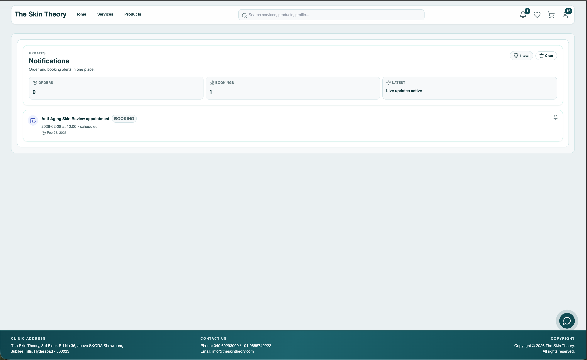
</p>

### 🛒 Cart & Wishlist
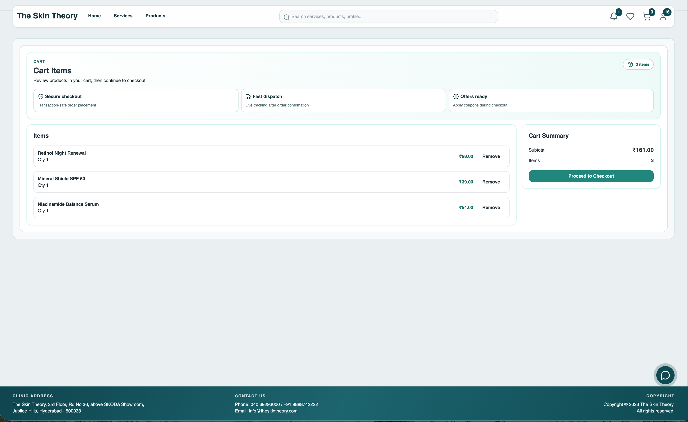

### 📋 My Bookings & Orders

<p align="center">
  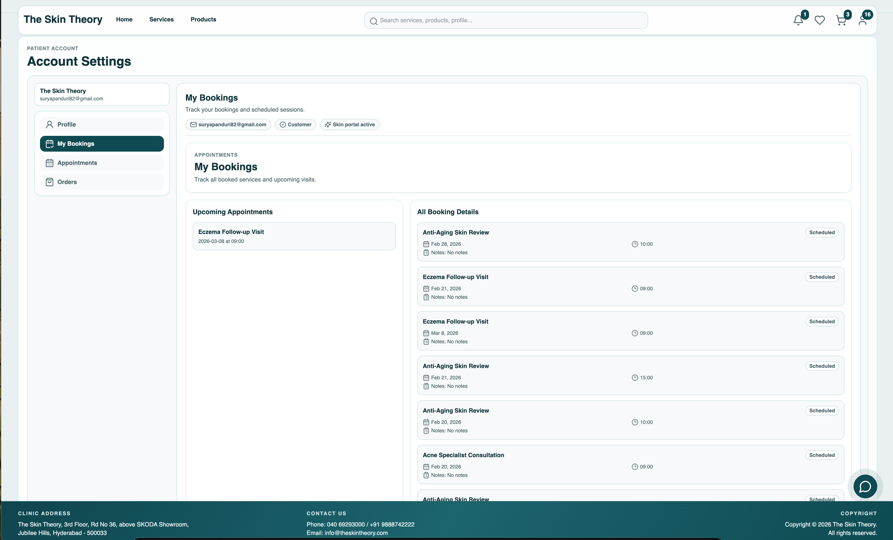
  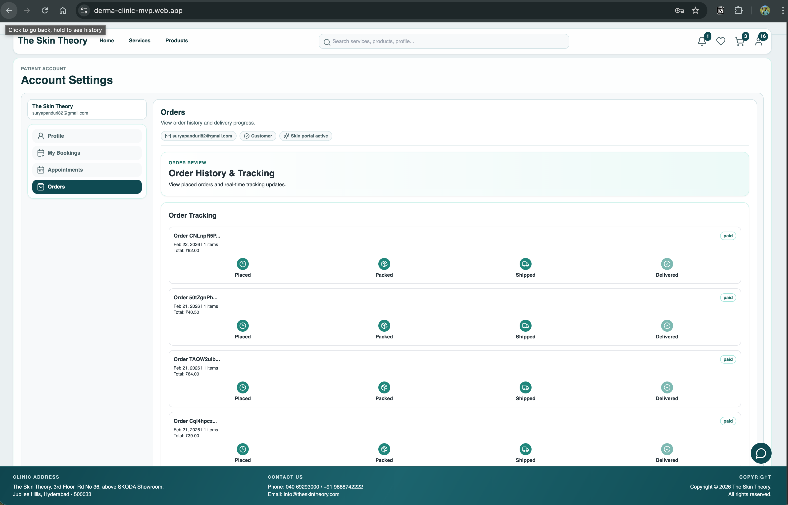
</p>


---

## Core Capabilities

### Clinic Operations (Admin)
- Appointment scheduling & slot management  
- Service catalog management  
- Product & order monitoring  
- Clinic analytics & performance insights  

### Patient Experience (Customer)
- Browse services & treatments  
- Book appointments & select slots  
- Manage bookings & order history  
- Wishlist & cart functionality  

### Communication & Workflow
- Patient enquiry management  
- Notification system  
- Booking status updates  

### Security & Access
- Secure authentication via Firebase  
- Role-based access control  
- Admin privilege management  

---

## Architecture

The platform uses a modular service architecture to support backend flexibility and scalability.

##API Interfaces

```
↓
Service Provider
↓
Implementations
├── Firebase Services
└── Express API Services (optional)
```

### Design Advantages

- Backend can be replaced without UI changes  
- Supports migration to custom infrastructure  
- Encourages separation of concerns  
- Ready for enterprise-scale deployment  

---

## Technology Stack

### Frontend
- React + TypeScript
- Vite
- TailwindCSS
- Zustand (state management)
- TanStack Query (server state)

### Backend Integration
- Firebase Authentication
- Firestore Database
- Firebase Hosting & Analytics
- Express service layer (optional)

### Tooling
- PostCSS
- TailwindCSS
- Vite

---

## Project Structure

```
├── api/
│   ├── interfaces/
│   ├── implementations/
│   │    ├── firebase/
│   │    └── express/
│   └── repositories/
│
├── components/
├── hooks/
├── store/
├── views/
├── types/
└── utils/
```

---

---

## Security & Data Protection

- Firestore rules version controlled  
- Environment secrets excluded from Git  
- Role-based access via admin claims  
- Service abstraction prevents vendor lock-in  

---

## Roadmap

- Multi-clinic tenancy support  
- Payment gateway integration  
- Tele-consultation features  
- AI skin analysis integration  
- SMS & WhatsApp notifications  

---

## Intended Use

Designed for:

- Dermatology clinics  
- Aesthetic centers  
- Medical spas  
- Healthcare SaaS deployments  

---

## Author

Built with a focus on real-world clinic workflows, scalability, and production readiness.